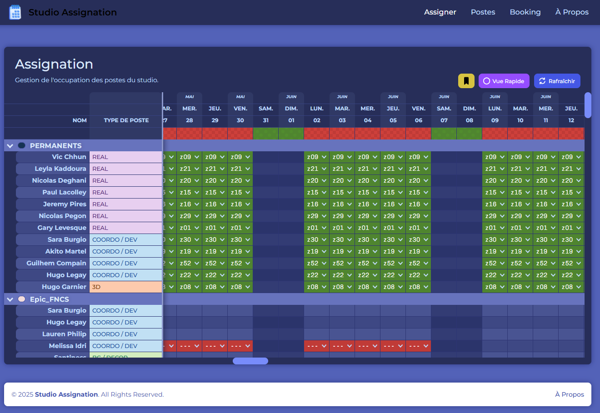
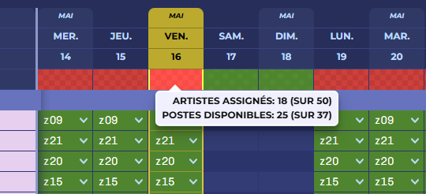
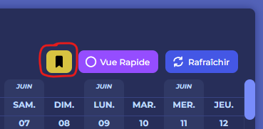
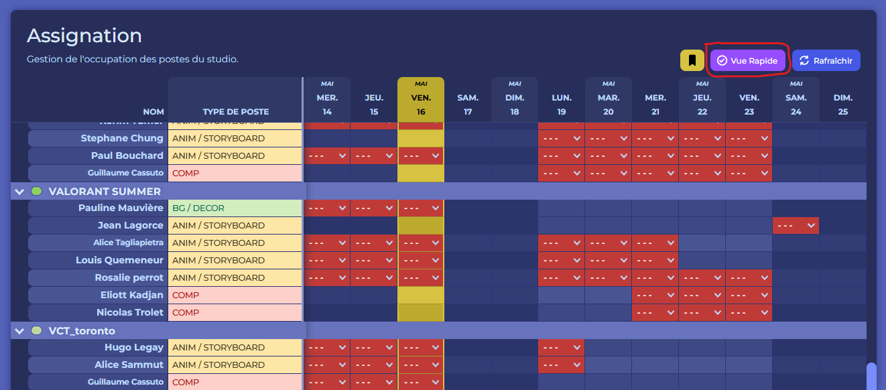
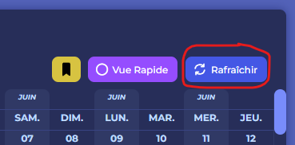
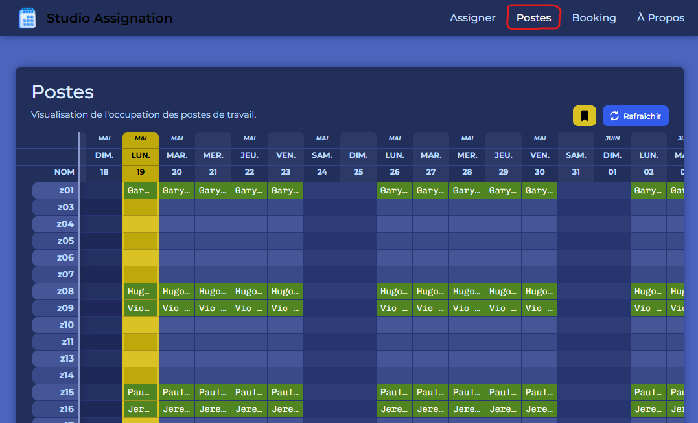
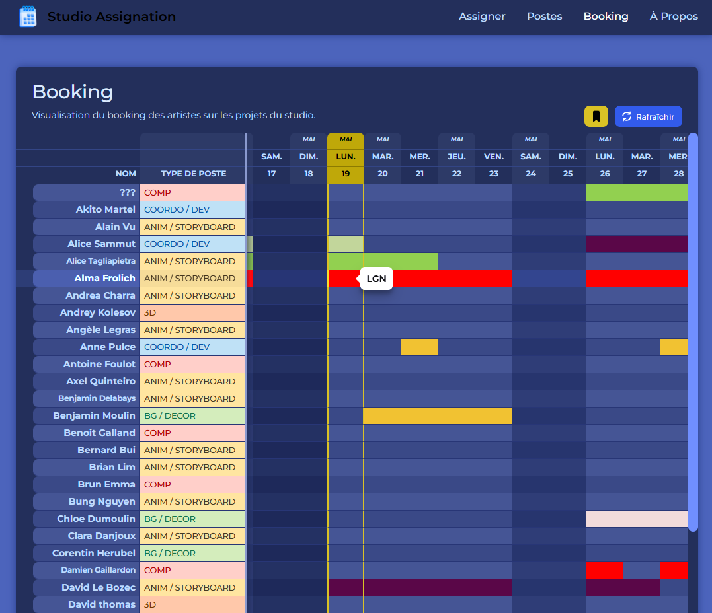

# Studio Assignation

## Description

Studio Assignation est un outil permettant d'assigner rapidement et facilement des 
machines aux artistes des différentes productions de Wizz. Son objectif est d'agglomérer 
des informations de planning éparpillées de pars et d'autres du studio dans une interface 
unique, en évitant ainsi de nombreuses erreurs humaines (fautes d'orthographe,
assignations multiples, etc...)

## Interface

L'interface se compose de trois éléments distincts :
- En haut, on trouve un menu permettant de naviguer à travers les 
  différentes pages du studio assignation. **Chaque page** correspond à **une 
  fonctionnalité** (à l'exception du bouton `A propos`)
- Au centre, est placé le planning, élément central de l'outil, et avec 
  lequel vous serez principalement amené à intéragir.
- Enfin, on retrouve en bas un footer avec un unique bouton amenant à la 
  page `à propos`.

## Assigner

### Comment utiliser le planning

A gauche sont placés des onglets correspondant aux différents projets du 
studio. Ceux-ci peuvent être déployés ou repliés à tout moment. Ils 
regroupent les différents artistes travaillant pour ce projet.

(Précision : une catégorie spéciale nommée `Permanents` est visible et 
comprends toutes les personnes employées à plein temps, n'étant pas assigné 
à de projet spécifique, et jouissant donc d'une machine à temps plein.)

En haut, on retrouve les dates à venir, à l'instar d'un bête et méchant 
calendrier. Lorsque l'outil est ouvert, celui-ci vient se placer directement 
sur le jour actuel.

C'est via un clic sur une case (correspondant donc à un artiste et à une 
date) que l'artiste pourra assigner une machine spécifique. La liste des 
machines disponibles est restreinte en fonction de deux paramètres :
- La machine n'est pas occupée pour ce jour;
- La machine est accessible pour le type de poste de l'artiste (certaines 
  machines étant prévues pour certaines catégories de métiers, alors que 
  d'autres non.).

### Récapitulatif des assignations

En dessous des dates, se trouve une barre d'informations dont les cases se 
colorent en rouge, en orange ou en vert, en fonction du nombre d'artistes 
encore non assignés et du nombre de postes disponibles. Vous pouvez survoler 
la case pour avoir le détail de ces données.

Le code couleur fonctionne de la manière suivante :
- **Rouge** : Il n'y a pas assez de poste disponible pour tous les artistes.
  (_Le nombre d'artiste à assigner est supérieur au nombre de 
  postes disponibles pour cette date, avec au moins un artiste qui n'est pas 
  assigné._)
- **Orange** : Il y a suffisamment de machines pour tous les artistes en 
  poste, mais les assignations ne sont pas terminées. (_Le nombre d'artiste à 
  assigner est inférieur au nombre de 
  postes disponibles pour cette date, avec au moins un artiste qui n'est pas 
  assigné._)
- **Vert** : Tous les artistes sont assignés.

### Centrer le jour d'aujourd'hui

Ce bouton, malgré l'affreux pléonasme dont est victime cette documentation, 
permet de centrer la vue sur la date du jour.

### Vue condensée

La vue condensée, aussi appelée `vue rapide` dans l'interface, permet de 
retirer l'affichage de toutes les lignes d'artiste qui n'ont actuellement 
aucune mission dans le studio pour la semaine à venir.

Cette option est disponible pour **toutes les vues** de l'outil.

Cette vue est pratique pour avoir très rapidement la vision des artistes qui 
n'ont pas encore été assigné·e·s.

### Synchronisation des données

Actuellement, les données sont récupérée depuis un google sheets 
supplémentaire, qui est utilisé en tant que base de données. Vous n'y avez 
pas accès en tant qu'utilisateur. 

En revanche, cela implique que l'outil doit se synchroniser de manière 
régulière à cette base de données. Cette synchronisation est effectuée 
toutes les sept minutes, mais peut être forcée via le bouton `Rafraîchir`, 
en haut à droite de l'interface. 

Utilisez ce bouton si un élément important 
qui a été ajouté ailleurs (tel qu'une machine ou un artiste) n'est pas 
visible dans l'application.

Cette option est disponible pour **toutes les vues** de l'outil. Il n'est 
pas utile de rafraîchir les données pour chacune d'entre elles (toutes les 
données étant synchronisées pour tous les éléments).

## Postes

La vue `Postes`, accessible depuis la barre du menu tout en haut de l'outil, 
permet d'avoir une vue rapide des différentes machines du parc et leurs 
assignations en fonction des jours. Elle permet de cibler un poste précis et 
de voir les dates où il est disponible ou non.

Survoler un élément pendant un court laps de temps permet d'afficher le nom 
complet de la personne.

## Booking

La vue `Booking` permet d'avoir une vue rapide des différentes assignations 
des artistes, par jour, en précisant cette fois non plus les machines mais 
les projets.

Chaque case colorée fait référence à un projet précis (la couleur de 
celle-ci est précisée dans notre document de synchronisation et peut donc, 
au besoin, être changée). On retrouve cette couleur dans la vue `Assigner`, 
juste à côté du nom de chaque projet.